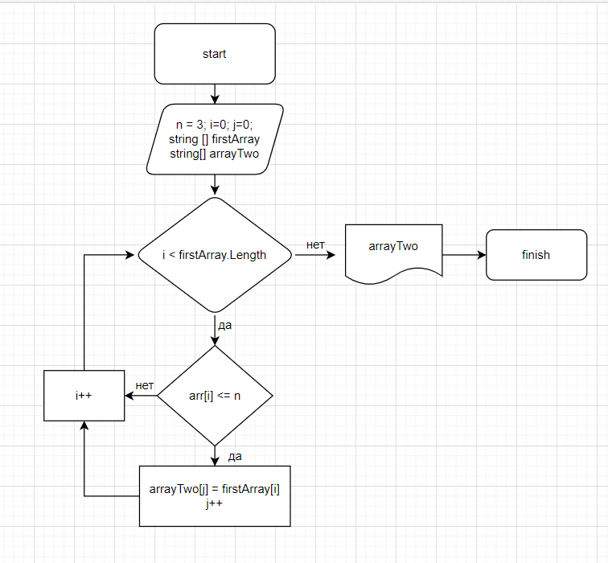

# Итоговый проект

## Задача
Написать программу, которая из имеющегося массива строк формирует новый массив из строк, длина которых меньше, либо равна 3 символам.

## **Решение:**
1. Создали строковый массив
2. Создали метод, заполняющий массив элементами, введенными пользователем
3. Вывели массив на экран
4. Определили длину нового массива
5. Создали условие окончания, если размер второго массива равен нулю
6. Создали метод, заполняющий новый массив элементами, удовлетворяющих условие из первого массива
7. Вывели новый массив на экран

*Блок-схема решения*

